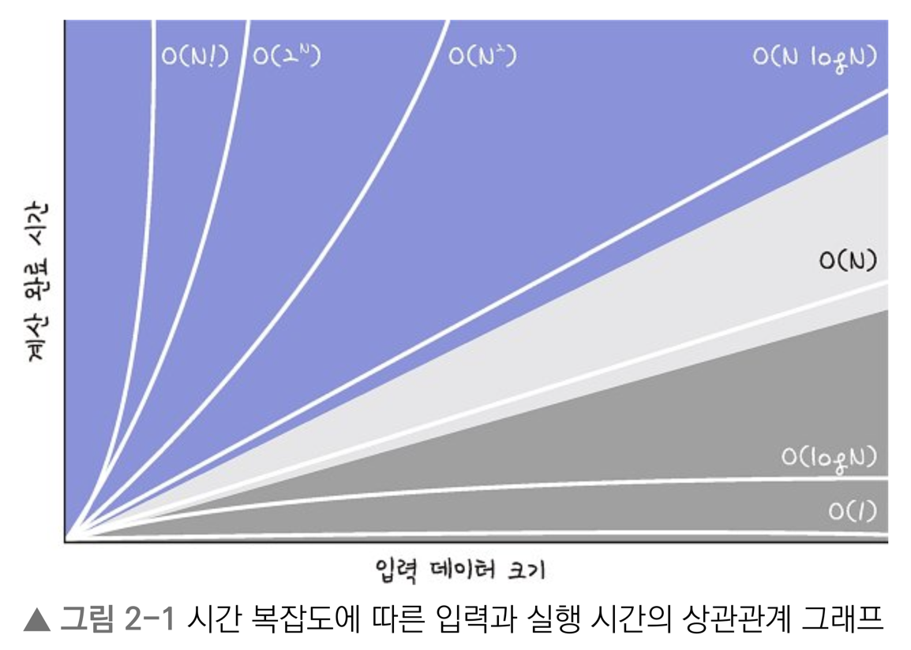

# 취업과 이직을 위한 프로그래머스 코딩 테스트 문제 풀이 전략 자바 편

## Chapter 2. 시간 복잡도

#### 알고리즘과 시간 복잡도

| 알고리즘  | 시간 복잡도      |
|-------|-------------|
| 이진 탐색 | `O(logN)`   |
| 선형 탐색 | `O(N)`      |
| 정렬    | `O(N logN)` |
| 조합    | `O(2^N)`    |
| 순열    | `O(N!)`      |

#### 시간 복잡도별 N 크기에 따른 게산 결과(정수로 반올림)

|             | 10        | 20        | 100 | 10,000  | 1,000,000 | 100,000,000 |
|-------------|-----------|-----------|-----|---------|-----------|-------------|
| `O(1)`      | 1         | 1         | 1   | 1       | 1         | 1           |
| `O(logN)`   | 3         | 4         | 7   | 13      | 20        | 27          |
| `O(N)`      | 10        | 20        | 100 | 10,000  | 1,000,000 | 100,000,000 |
| `O(N logN)` | 33        | 86        | 664 | 132,877 | -         | -           |
| `O(2^N)`    | 1,024     | 1,048,576 | -   | -       | -         | -           |
| `O(N!)`      | 3,628,800 | -         | -   | -       | -         | -           |

#### 제한 시간이 1초일 때 유추 가능한 시간 복잡도와 알고리즘

| N      | 유추 가능한 시간 복잡도           | 유추 가능한 알고리즘 |
|--------|-------------------------|-------------|
| 10     | `O(N!)`                 | 순열          |
| 20     | `O(2^N)`                | 조합          |
| 1,000~ | `O(N^3)`, `O(N^3 logN)` | 완전 탐색, 이진 탐색 |
| 10,000 | `O(N logN)`              | 정렬, 이진 탐색   |

